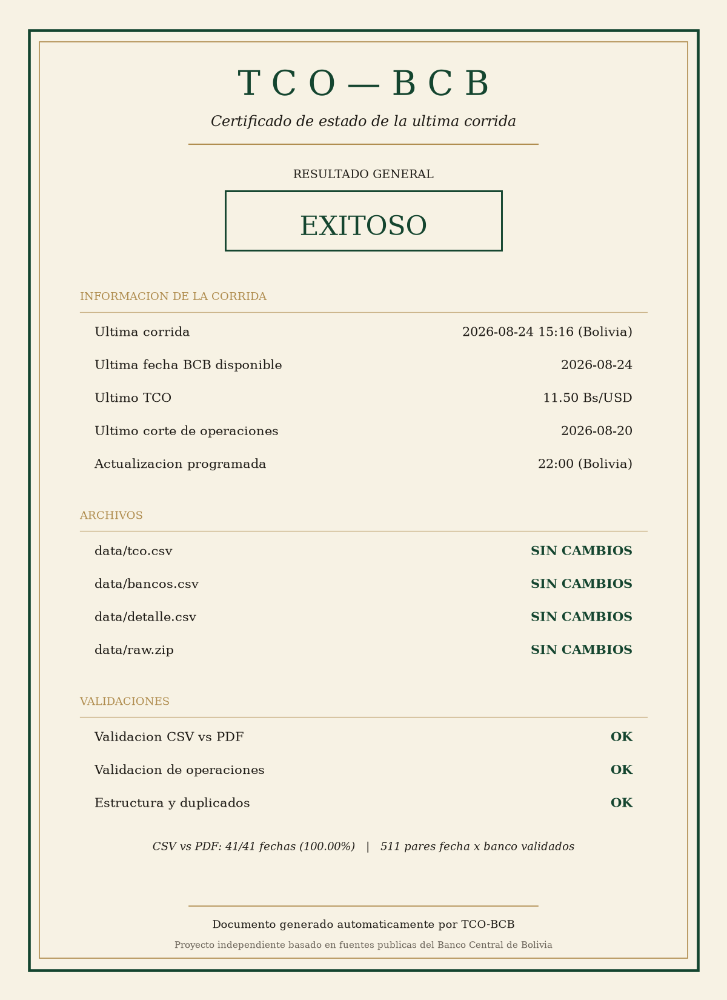

# TCO-BCB

Base histórica, diaria y verificable del **Tipo de Cambio Oficial (TCO)** del dólar
estadounidense y de las **operaciones cambiarias del sistema bancario boliviano**,
construida automáticamente a partir de las publicaciones del Banco Central de Bolivia.



> **Advertencia.** Este es un proyecto **independiente**, sin relación institucional con
> el Banco Central de Bolivia. Se limita a recopilar, ordenar y validar información
> **pública y oficial** del BCB. La fuente autorizada sigue siendo el BCB.

---

## Fuentes oficiales

Se usan URL limpias, sin parámetros de rastreo.

| Fuente | URL | Uso |
|---|---|---|
| PDF anual de cotizaciones | `bcb.gob.bo/tiposDeCambioHistorico/pdf.php?anio=AAAA` | **Fuente autoritativa** de la serie diaria |
| CSV de operaciones por banco | `bcb.gob.bo/tco_tcreferencial_descargar_csv.php?desde=&hasta=` | **Fuente autoritativa** de bancos y detalle |
| Tabla anual en HTML | `bcb.gob.bo/tiposDeCambioHistorico/index.php?anio=AAAA` | Solo se archiva como evidencia |
| Página de la serie de TCO | `bcb.gob.bo/?q=content/tipo-de-cambio-oficial-...-serie-de-tiempo` | Comprobación de acceso |

### Por qué el PDF y no el HTML, XLS u ODS

El BCB ofrece la tabla anual en cuatro formatos. **No son equivalentes.**

A partir de junio de 2026 el BCB dejó de publicar cotizaciones de *compra* y *venta* y
pasó a publicar un **TCO único**. El PDF refleja ese cambio: su encabezado pasa de
`VENTA / COMPRA` a `OFICIAL`, e incluso repite el mes de junio en dos bloques porque el
cambio ocurrió a mitad de mes.

Las vistas HTML, XLS y ODS conservan el formato heredado de dos columnas y, para el
período nuevo, **fabrican una "venta" inexistente** igual al oficial más 0,10:

| Fecha | PDF (oficial) | HTML (venta / compra) |
|---|---|---|
| 2026-07-21 | `10,90` | `11,00` / `10,90` |
| 2026-07-31 | `12,15` | `12,25` / `12,15` |

Por eso este proyecto lee el PDF por coordenadas (sin OCR) y **nunca** usa las otras
vistas como fuente de datos.

---

## Archivos

### `data/tco.csv` — serie diaria de cotizaciones

Una fila por **fecha de vigencia**. Clave de deduplicación: `vigencia`.

```csv
fecha_corte,vigencia,tco_compra,tco_venta,tco_oficial
,2026-06-25,6.86,6.96,
2026-06-26,2026-06-29,,,9.73
2026-08-20,2026-08-21,,,11.52
```

* `tco_compra` y `tco_venta` solo existen hasta el cambio metodológico de junio de 2026.
* `tco_oficial` solo existe a partir de ese cambio.
* **Si una variable no existe metodológicamente para una fecha, el campo queda vacío.**
  No se rellena, no se interpola y no se deriva una serie inexistente.
* `fecha_corte` queda vacío en los días sin reporte de operaciones (fines de semana y
  feriados, donde sigue vigente el TCO del último día hábil).

### `data/bancos.csv` — agregado diario por banco

Una fila por **fecha de corte × banco**. Clave: `(fecha_corte, banco)`.

```csv
fecha_corte,vigencia,banco,operaciones,monto_usd,tco
2026-08-20,2026-08-21,BANCO GANADERO,142,7434731,11.52
2026-08-20,2026-08-21,TOTAL BANCOS,1175,32711090,11.52
```

Incluye la fila `TOTAL BANCOS` tal como la publica el BCB: su `tco` es el **Tipo de
Cambio Oficial** de esa vigencia. Los campos vacíos son celdas que el BCB no publica.

### `data/detalle.csv` — máximo nivel de detalle oficial

Una fila por **fecha de corte × banco × tipo de cambio**. Clave: `(fecha_corte, banco, tc)`.

```csv
fecha_corte,vigencia,banco,tc,operaciones,monto_usd
2026-08-20,2026-08-21,BANCO BISA,11.9000,3,6759
```

No es una aproximación: se construye directamente del CSV oficial. Contiene solo los
14 bancos reales; `TOTAL BANCOS` se omite por ser la suma, y se usa para validar.

### `data/raw.zip` — archivo original para auditoría

```
historico/2026.pdf          PDF anual oficial
operaciones/AAAA-MM-DD.csv  una rebanada por fecha de corte
tco/2026.html               tabla anual en HTML
manifest.json               SHA-256 y tamaño de cada archivo
```

Deduplicado por SHA-256 y con bytes deterministas: un archivo idéntico nunca se
duplica ni se reescribe. El PDF anual se compara por **huella de su texto**, porque el
BCB lo regenera en cada descarga con un timestamp y un UUID nuevos.

### `status/status.png`

Certificado de estado generado con Python (matplotlib) tras cada corrida. Refleja el
resultado real: si una validación falla, no muestra un certificado verde de éxito.

---

## Fidelidad de los datos

Los valores se guardan **exactamente como los publica el BCB**. Lo único que cambia es
el separador decimal (coma → punto) y se elimina el separador de miles, para que los
archivos sean legibles por cualquier herramienta.

No se redondea, no se recalcula, no se rellena y no se corrige ningún valor. El `tc`
conserva sus 4 decimales, los montos son enteros en dólares y el TCO sus 2 decimales,
igual que en la fuente.

---

## Validación

Todas las validaciones se ejecutan en cada corrida y su resultado aparece en la salida
y en el certificado.

### CSV vs PDF (fuentes independientes)

El TCO derivado del **CSV de operaciones** (fila `TCO`, columna `TOTAL BANCOS`) se
compara contra el **PDF anual**, fecha por fecha de vigencia, con tolerancia de
`1e-4` —solo para error de representación decimal, nunca para diferencias económicas
reales—. Se informan fechas comparadas, coincidencias, diferencias, porcentaje y
fechas faltantes en cada fuente. Ninguna fuente sobrescribe a la otra en silencio.

### Validaciones internas de operaciones

| Comprobación | Tolerancia | Fundamento |
|---|---|---|
| `SUM(detalle.operaciones)` vs agregado del banco | exacta | coincide al 100 % |
| `SUM(detalle.monto_usd)` vs agregado del banco | `0,5 × nº de celdas` | el BCB redondea cada monto a USD entero |
| `SUM(tc × monto) / SUM(monto)` vs TCO publicado | `0,005` | el TCO publicado es la media ponderada llevada a 2 decimales |
| Suma de los 14 bancos vs `TOTAL BANCOS`, por cada TC | ídem | consistencia interna de la fuente |

Las tolerancias se derivaron midiendo la propia fuente, no se eligieron para que las
comprobaciones pasaran.

### Estructura

Ausencia de duplicados según las claves declaradas arriba y orden cronológico.

---

## Uso

```bash
pip install -r requirements.txt

python prepare.py   # una sola vez: construye las bases desde cero
python main.py      # corrida diaria
```

`main.py` es idempotente: ejecutarlo dos veces con el mismo estado del BCB no duplica
filas, no reescribe los CSV, no duplica archivos en `raw.zip` y no regenera
`status.png`. Si el BCB no publicó nada nuevo, imprime `NO_NEW_DATA` y termina sin
modificar nada. Devuelve código de salida distinto de cero si alguna validación falla.

---

## Frecuencia de actualización

GitHub Actions ejecuta `main.py` una vez al día a las **22:00 de Bolivia**
(`0 2 * * *` UTC), y también a demanda vía `workflow_dispatch`. Solo se genera commit
cuando hay cambios reales.

---

## Notas sobre el calendario

* La **fecha de corte** es el día de las operaciones; la **vigencia** es el día en que
  rige el TCO resultante. Un corte de viernes rige el lunes siguiente.
* La vigencia puede ser un **bloque de feriados**. El BCB lo publica como
  `2026-08-06 al 2026-08-10`; ese literal se conserva en `bancos.csv` y `detalle.csv`,
  y en `tco.csv` se expande a un día por fila.
* Los días sin cotización en el PDF son feriados bolivianos reales. En 2026, por
  ejemplo, el 4 y 5 de junio (Corpus Christi y puente) y el 22 de junio (Año Nuevo
  Andino trasladado).

---

## Cobertura

* Serie de cotizaciones: desde **2026-06-01**.
* Operaciones por banco: desde **2026-06-26**, primer corte publicado por el BCB.

---

## Licencia

Código bajo licencia MIT. Los datos son de dominio público y pertenecen al Banco
Central de Bolivia.
